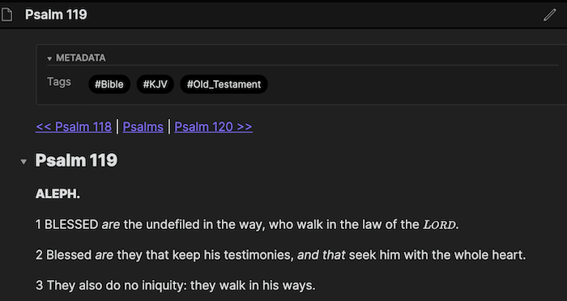

# av-roam
Generates a King James ([Authorized Version](https://en.wikipedia.org/wiki/King_James_Version)) text that is formatted for import into a Roam Research database.

It uses Roam markdown and [LaTeX](https://en.wikipedia.org/wiki/LaTeX) features to approximate the original print as much as possible.



## Features

1. One chapter per note, one verse per block.
1. Navigational metadata: *Previous/Next* chapter links and `#<Book>` tags
1. _italicized_ words to indicate translation additions
1. _yhwh_ formatted LORD as in the original print
1. original print paragraph markings and chapter notes
1. KJV Cambridge
1. Table of Contents Page: `KJV`

## Usage

1. [Download the current release](https://github.com/pmbauer/av-roam/releases/download/5fa7989/av-roam_5fa7989.tar.gz) and extract locally
2. Use Roam Research `...` menu and select `Import Files`
3. Choose chapters you wish to import.

## Import Everything
Note that importing a corpus as large as the entire Bible *will* impact your database's performance, so for now it's recommended to import chapters ad-hoc.

But if you still wish to import everything, there is a [public KJV Roam](https://roamresearch.com/#/app/KJV).
From there you can JSON-export the contents and import into your personal database.
N.B. that version is missing a number of features from the original AV translation: _italicized_ words to indicate translation word additions, footnotes, chapter and section headings (e.g. Psalms 119)

## Building
```bash
# builds release artifact
make
make build

# run tests
make test

# clean up
make clean
```
